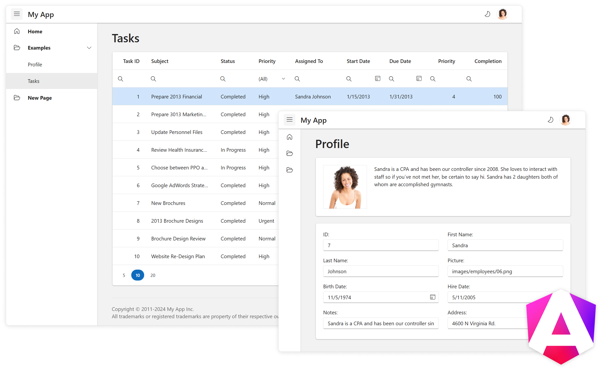

# 🚀 GRDF Tracker - Frontend Angular

Application Angular développée dans le cadre du projet GRDF Tracker.

Ce projet utilise le **template DevExtreme Angular**, enrichi par des fonctionnalités spécifiques à la gestion des interventions pour GRDF.



---

## 📦 Fonctionnalités principales

- Interface responsive avec DevExtreme
- Navigation latérale dynamique
- Formulaires interactifs pour :
  - Signaler une défaillance
  - Consulter les tâches
  - Noter un technicien
- Dashboard statistiques personnalisé
- Intégration CI/CD via Jenkins
- Tests automatisés avec Selenium
- Génération de rapports HTML avec Mochawesome

---

## 🧪 Tests et CI/CD

Le projet est intégré à Jenkins via un `Jenkinsfile` :

- Build frontend (`npm install` + `ng build`)
- Tests Selenium exécutés automatiquement
- Rapport HTML généré et archivé comme artefact
- Pipeline déclenchée automatiquement via GitHub Webhook

---

## 🛠️ Technologies

- Angular 17
- TypeScript
- DevExtreme
- PrimeNG
- Selenium
- Jenkins
- Mochawesome

---

## 📂 Structure

```bash
PFE GRDF-tracker/
│
├── GRDF/             # Frontend Angular
├── GRDFBack/         # Backend Spring Boot
├── Jenkinsfile       # Pipeline CI/CD
└── selenium-tests/   # Tests automatisés
